# FlashNotes - Documentación
## Fase 1: Requisitos
### Requerimientos del Negocio
#### Contexto del Proyecto
- Nombre de la Organización o Programador: Jesús Ángel Martínez Mendoza
- Tipo de Organización: Independiente
- Sector: No aplica
- Producto o servicios que ofrece: Programación de aplicaciones y Sistemas
- Necesidades especificas: No aplica
- Ubicación: No aplica

#### Identificación del Problema u Oportunidad de Mejora
El problema que se identifico, es que al usar el *Blog de notas* o *Notepad* tanto en linux como en Windows se generan muchas notas innecesarias y/o basura, esto en el uso diario de estas aplicaciones; hasta el momento aplicaciones similares de notas general el mismo problema.

#### Objetivos del Negocio
Ofrecer una herramienta sencilla para notas temporales que reduzca el desorden digital en la productividad diaria de los usuarios.

#### Declaración de la Visión del Producto

**FlashNotes** es un software dirigido al publico en general, que use notas rápidas para organizar sus ideas o notas, las cuales son temporales, resuelve el problema de generación de basura y archivos innecesarios, así como dar la oportunidad de guardar la nota (en caso de requerirla), su principal ventaja, es que evita notas innecesarias, y solo temporales.


### Alcance
#### Diagrama de Contexto

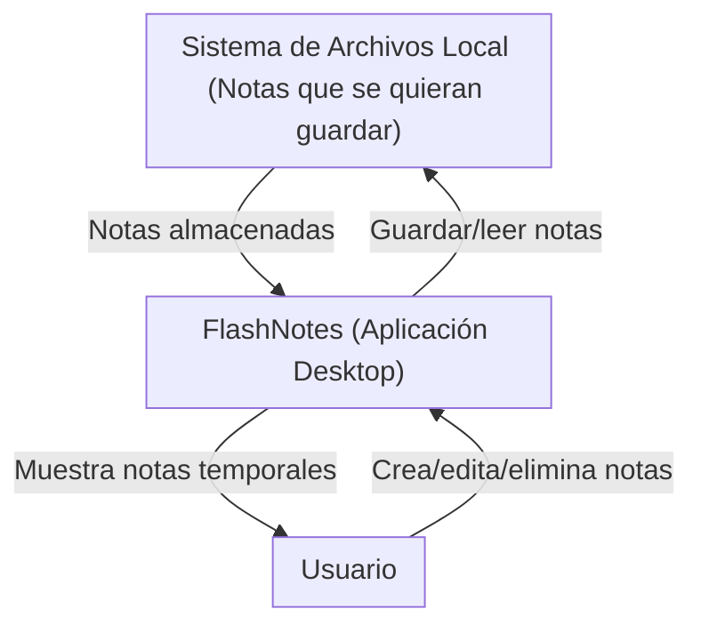

#### Descripción del Alcance del Producto (Árbol de caracteristicas)

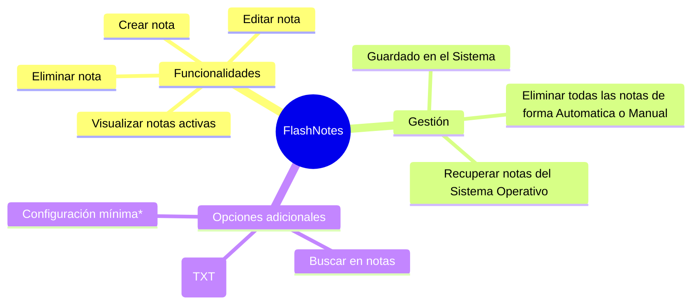
### Anexos
Entrevistas realizadas, documentos o reportes, diagramas, etc...

### Requerimientos del Usuario

**Identificación**:

- Como un **Usuario**, yo necesito **crear notas** así que de esta manera **tener texto a mi alcance**.
- Como un **Usuario**, yo necesito **que las notas se eliminen de forma manual o automatica** así que de esta manera **no genere notas innecesarias, o que fueron temporales**.
- Como un **Usuario**, yo necesito **guardar aquellas notas que considere que se deban guardar** así que de esta manera **se guarde como un `.txt` en mi computadora**.
- Como un **Usuario**, yo necesito **una Interfaz Gráfica de Usuario (GUI)** así que de esta manera **pueda tener acceso a las funcionalidades de la aplicación**.
- Como un **Usuario**, yo necesito **buscar una palabra o cadena de caracteres** así que de esta manera **pueda editar con mayor facilidad**.

**Formato**:

|Id | Nombre | Usuario | Descripción | Pruebas de Aceptación | Puntos / DI / Prioridad |
|---|--------|---------|-------------|-----------------------|-------------|
|HU1 | Creación de notas | Usuario | Crear un espacio para la nota | Verificar que el usuario tiene donde escribir y pueda realizar las notas | 1 |
|HU2 | Eliminar notas | Usuario / Aplicación | Eliminar todas las notas actuales al cerrar la aplicación o al hacer click en un botón | Verificar que al abrir la aplicación ya no haya notas, y después de hacer click | 1 |
|HU3 | Guardar notas | Usuario | Que la nota que el usuario quiera guardar se almacene en el SO con la extensión `.txt` | Verificar que el contenido del `.txt` sea el mismo que el de la aplicación al momento de guardar | 2 |
|HU4 | GUI | Usuario | Interfaz Gráfica de Usuario | Verificar que todos los botones y funcionalidades, esten funcionando como se deben | 1 |
|HU5 | Buscar Palabras | Usuario | Buscar palabra en la nota, y que mueva el puntero al inicio de la primera palabra encontrada | Ingresar texto, y verificar si esa palabra se encuentra | 3 | 

**Diagrama de Casos de Uso**
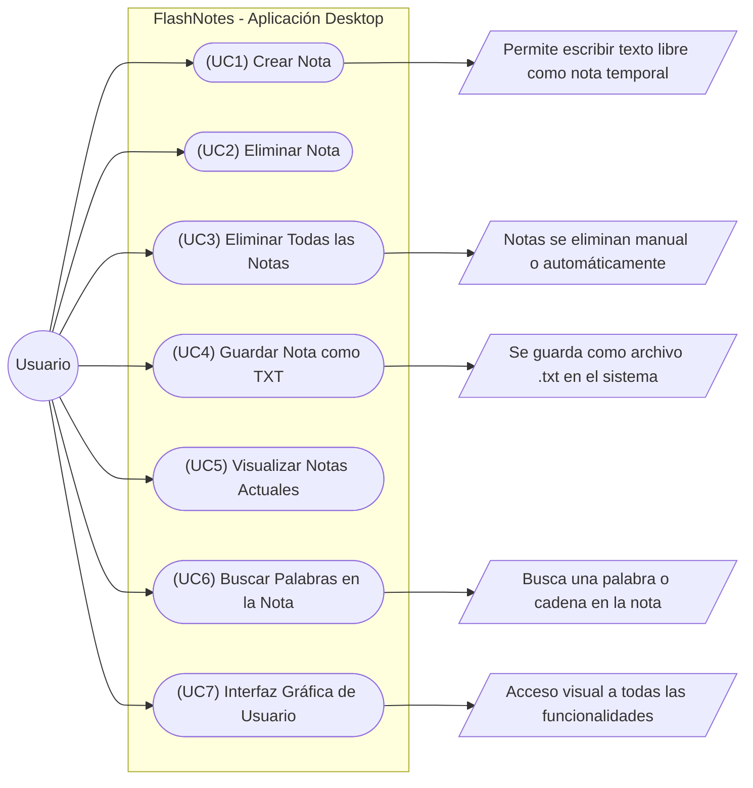

### Plan y Viabilidad

#### Agrupar las historias por Prioridad

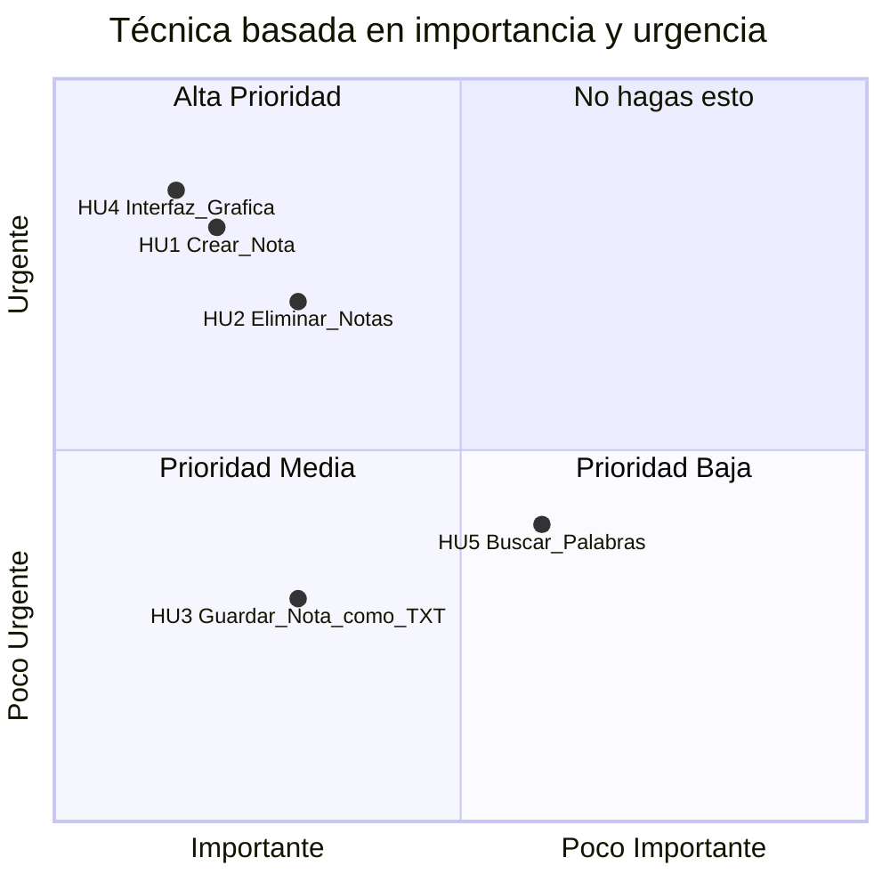


### Estimar Tiempos

#####  **Fórmula General**

$$
\text{Tiempo Total} = \left( \frac{\text{Puntos Totales}}{\text{Número de Personas}} \right) \times \text{Factor de Ajuste}
$$


* **Número de personas = 1**
* **Factor de ajuste recomendado = 1.33** (para considerar imprevistos, errores, pausas, pruebas, etc.)

Supón que estas son tus HU y sus puntos de prioridad (ahora cuanto más alto, más dificil de programar).

| ID | Historia de Usuario               | Puntos | Prioridad |
| -- | --------------------------------- | ------ | --------- |
| 1  | Crear Nota                        | 3      | Alta      |
| 2  | Eliminar Todas las Notas          | 3      | Alta      |
| 3  | Guardar Nota como TXT             | 2      | Media     |
| 4  | Interfaz Gráfica de Usuario (GUI) | 5      | Alta      |
| 5  | Buscar Palabras en la Nota        | 1      | Baja      |


**Total de puntos = 14**

Entonces:

$$
\text{Tiempo Total} = \left( \frac{14}{1} \right) \times 1.33 = 18.62 \text{ días} \approx 19 \text{ días}
$$


---
#####  **Planificación en Etapas (Estilo Cascada)**

Aunque la metodología cascada no tiene iteraciones como tal, puedes desglosarlo por fases:

| Fase                | Actividades Relacionadas                                                      | Duración Estimada |
|---------------------|-------------------------------------------------------------------------------|-------------------|
| **1. Análisis**      | - Revisar y confirmar requerimientos del usuario                             | 1 día             |
|                     | - Redactar historias de usuario y validar con ejemplos prácticos              | 1 día             |
| **2. Diseño**        | - Crear boceto de la interfaz (mockup)                                        | 1 día             |
|                     | - Definir estructura de carpetas, clases, y funciones base                    | 2 días            |
|                     | - Elegir librerías o tecnologías (por ejemplo, `tkinter`, `PyQt`, etc.)       | 1 día             |
| **3. Implementación**| - Programar funcionalidades por orden de prioridad (HU1 → HU5)               | 10 días           |
|                     | - Integrar cada funcionalidad con GUI                                         | 2 días            |
| **4. Pruebas**       | - Pruebas funcionales (crear, guardar, borrar notas)                         | 2 días            |
|                     | - Pruebas de interfaz y usabilidad                                            | 1 día             |
| **5. Documentación** | - Documentación técnica y de usuario (`README.md`, comentarios en código)     | 2 días            |
| **6. Entrega/Ajustes**| - Corrección de errores, mejoras visuales y funcionales, empaquetado final  | 2 días            |

| ** Total estimado**                                                                          | **25 días**        |


#### Estudio de Viabilidad

**Viabilidad Técnica**

| Aspecto Técnico | Disponibilidad Actual | Brechas o Necesidades | Observaciones |
|-----------------|-----------------------|-----------------------|---------------|
|Infrestructura | - | - | - | - |
|Equipo | Computadora Personal | - | - | - |
|Software | - | - | - | - |
|Capacidad del Personal | - | - | - | - |

**Viabilidad Económica**


| Recurso | Alternativa 1 (Local) | Alternativa 2 (Nube) | Costo Anual (Local) | Costo Anual (Nube) | Observaciones |
|-|-|-|-|-|-|
|Hardware|-|-|-|-|-|
|Software|-|-|-|-|-|
|Almacenamiento|Disco Local|-|-|-|-|
|Conectividad|-|-|-|-|-|


**Diagrama de Tendencias Costo - Beneficio**
No aplica

**Viabilidad Operativa**

| **Factor**                     | **Descripción**                                                                  | **Estado Actual**                     | **Necesidades o Brechas**                 | **Observaciones**                                          |
| ------------------------------ | -------------------------------------------------------------------------------- | ------------------------------------- | ----------------------------------------- | ---------------------------------------------------------- |
| **Disponibilidad de Personal** | Capacidad del personal para operar y mantener el sistema.                        | Un programador .            | Buena gestión del tiempo.                 | Es posible avanzar en tiempos razonables con organización. |
| **Procesos Actuales**          | Compatibilidad de los procesos actuales con el sistema propuesto.                | No existen procesos formales.         | Definir flujo de trabajo personal.        | Puedes aplicar Git y una metodología simple como Kanban.   |
| **Infraestructura**            | Adecuación de la infraestructura actual para soportar el sistema.                | PC personal con Linux/Windows.        | Ninguna.                                  | El proyecto no demanda muchos recursos.                    |
| **Cultura Organizacional**     | Aceptación y adaptación de los usuarios al nuevo sistema.                        | No aplica.                            | -                                         | Al ser personal, puedes validar usabilidad contigo mismo.  |
| **Soporte Técnico**            | Disponibilidad de soporte técnico para resolver problemas y mantener el sistema. | Autosoporte con búsqueda y comunidad. | Participar en foros y leer documentación. | Stack Overflow, GitHub y ChatGPT pueden ser aliados clave. |


---

## Fase 2: Diseño

### Identificación de Entidades

* `Main`
* `ControladorNotas`
* `VistaNotas`
* `GestorNotas`
* `NotaDAO`
* `Nota`

---

### Diseño Arquitectónico

#### Definición de la arquitectura

Se usará el patrón de diseño **Modelo-Vista-Controlador (MVC)** para separar responsabilidades y facilitar el mantenimiento.

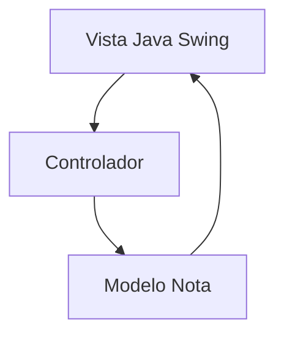

#### Selección de Tecnología

* Lenguaje: `Java 23`
* GUI: `Java Swing`
* Persistencia: Archivos `.txt` (no se usa base de datos)
* Arquitectura: `MVC`

---

### Diseño Estático

#### Diagrama de Clases UML

Note como algunas clases no poseen constructor.

```mermaid
classDiagram
    direction LR

    %% ----------------------
    %% Modelo: Clases de Datos
    %% ----------------------
    class Nota {
        - contenido: String
        + getContenido(): String
        + setContenido(String): void
    }
    note for Nota "Encapsula los datos de una nota. Es el objeto del dominio (HU1, HU3, HU5)."

    %% ----------------------
    %% Modelo: Capa de Persistencia (DAO)
    %% ----------------------
    class NotaDAO {
        + guardarNotaEnArchivo(Nota, String rutaArchivo): boolean
        + eliminarArchivoNotas(): void
    }
    note for NotaDAO "Maneja el acceso a datos. Es responsable de guardar una nota específica y de la eliminación de archivos temporales (HU2, HU3)."

    %% ----------------------
    %% Modelo: Capa de Lógica de Negocio
    %% ----------------------
    class GestorNotas {
        - List~Nota~ notas
        - NotaDAO notaDAO
        + crearNota(String): void
        + eliminarNota(int): void
        + eliminarTodas(): void
        + guardarNota(int indice, String rutaArchivo): boolean
        + buscar(String): int
        + getNotas(): List~Nota~
        + getNota(int indice): Nota
    }
    note for GestorNotas "Es el corazón de la lógica del negocio. Contiene la colección de notas y delega la persistencia a NotaDAO (HU1, HU2, HU3, HU5)."
    
    %% ----------------------
    %% Vista: Interfaz de Usuario
    %% ----------------------
    class VistaNotas {
        - notasArea: JTextArea
        - btnCrear: JButton
        - btnEliminar: JButton
        - btnEliminarTodas: JButton
        - btnGuardar: JButton
        - btnBuscar: JButton
        + mostrarNotas(List~String~): void
        + getTextoNota(): String
        + getRutaGuardado(): String
        + getIndiceNotaSeleccionada(): int
        + mostrarMensaje(String): void
        + addCrearListener(ActionListener): void
        + addEliminarListener(ActionListener): void
        + addGuardarListener(ActionListener): void
        + addBuscarListener(ActionListener): void
        + addEliminarTodasListener(ActionListener): void
    }
    note for VistaNotas "Responsable de la GUI. Permite al usuario interactuar con la aplicación y provee los datos al Controlador (HU4)."

    %% ----------------------
    %% Controlador: Orquestador
    %% ----------------------
    class ControladorNotas {
        - gestor: GestorNotas
        - vista: VistaNotas
        + ControladorNotas(GestorNotas, VistaNotas): void
        + actionPerformed(ActionEvent): void
    }
    note for ControladorNotas "Controla el flujo de la aplicación. Escucha los eventos de la Vista y coordina las acciones en el Modelo."

    %% ----------------------
    %% Punto de Entrada
    %% ----------------------
    class Main {
        + main(String[]): void
    }
    note for Main "Crea y conecta todas las instancias de las clases al inicio de la aplicación."

    %% ----------------------
    %% Relaciones
    %% ----------------------
    Main --> VistaNotas : crea instancia
    Main --> GestorNotas : crea instancia
    Main --> NotaDAO : crea instancia
    Main --> ControladorNotas : crea instancia

    GestorNotas "1" *-- "0..*" Nota : contiene
    GestorNotas --> NotaDAO : delega persistencia
    ControladorNotas --> GestorNotas : manipula estado
    ControladorNotas --> VistaNotas : actualiza GUI y escucha eventos
    NotaDAO ..> Nota : utiliza para guardar/cargar datos
```

<details>

```mermaid
classDiagram
    direction LR

    %% ----------------------
    %% Modelo: Clases de Datos
    %% ----------------------
    class Nota {
        - contenido: String
        + getContenido(): String
        + setContenido(String): void
    }
    note for Nota "Encapsula los datos de una nota. Es el objeto del dominio."

    %% ----------------------
    %% Modelo: Capa de Persistencia (DAO)
    %% ----------------------
    class NotaDAO {
        + guardarNotaEnArchivo(Nota, String rutaArchivo): boolean
        + cargarNotaDesdeArchivo(String rutaArchivo): Nota
        + guardarTodasLasNotas(List~Nota~ notas, String rutaArchivo): boolean
        + cargarTodasLasNotas(String rutaArchivo): List~Nota~
        + eliminarArchivoNotas(String rutaArchivo): void
        + cargarNotasDesdeDirectorio(String rutaDirectorio): List~Nota~
    }
    note for NotaDAO "Maneja el acceso a los datos (persistencia). Lee y escribe notas en archivos, individualmente o en lotes."

    %% ----------------------
    %% Modelo: Capa de Lógica de Negocio
    %% ----------------------
    class GestorNotas {
        - List~Nota~ notas
        - NotaDAO notaDAO
        + crearNota(String): void
        + eliminarNota(int): void
        + eliminarTodas(): void
        + guardarNota(int indice, String rutaArchivo): boolean
        + cargarNotasDesdeArchivo(String rutaArchivo): void
        + cargarNotasDesdeDirectorio(String rutaDirectorio): void
        + buscar(String): int
        + getNotas(): List~Nota~
        + getNota(int indice): Nota
    }
    note for GestorNotas "Contiene la colección de notas y delega persistencia a NotaDAO."

    %% ----------------------
    %% Vista: Interfaz de Usuario
    %% ----------------------
    class VistaNotas {
        - notasArea: JTextArea
        - btnCrear: JButton
        - btnEliminar: JButton
        - btnEliminarTodas: JButton
        - btnGuardar: JButton
        - btnBuscar: JButton
        + mostrarNotas(List~Nota~): void
        + getTextoNota(): String
        + getRutaGuardado(): String
        + getRutaCargado(): String
        + getIndiceNotaSeleccionada(): int
        + mostrarMensaje(String): void
        + addCrearListener(ActionListener): void
        + addEliminarListener(ActionListener): void
        + addGuardarListener(ActionListener): void
        + addBuscarListener(ActionListener): void
        + addEliminarTodasListener(ActionListener): void
    }
    note for VistaNotas "Presenta notas al usuario y maneja interacción sin lógica de negocio."

    %% ----------------------
    %% Controlador: Orquestador
    %% ----------------------
    class ControladorNotas {
        - gestor: GestorNotas
        - vista: VistaNotas
        + ControladorNotas(GestorNotas, VistaNotas): void
        + actionPerformed(ActionEvent): void
    }
    note for ControladorNotas "Coordina eventos de la vista y acciones en el modelo."

    %% ----------------------
    %% Punto de Entrada
    %% ----------------------
    class Main {
        + main(String[]): void
    }
    note for Main "Inicia la aplicación y conecta componentes."

    %% ----------------------
    %% Relaciones
    %% ----------------------
    Main --> VistaNotas : crea instancia
    Main --> GestorNotas : crea instancia
    Main --> NotaDAO : crea instancia
    Main --> ControladorNotas : crea instancia

    GestorNotas "1" *-- "0..*" Nota : contiene
    GestorNotas --> NotaDAO : delega persistencia
    ControladorNotas --> GestorNotas : manipula estado
    ControladorNotas --> VistaNotas : actualiza GUI y escucha eventos
    NotaDAO ..> Nota : utiliza para guardar/cargar datos
    VistaNotas ..> Nota : muestra datos
```

</details>

#### Modelo Lógico de Datos (ERD)

No aplica porque **no se usará base de datos**.

---

### Diseño Dinámico

#### HU1 – Crear una nota

Este diagrama refleja cómo se crea un nuevo objeto `Nota` a través de la capa del `GestorNotas` y se actualiza la interfaz.

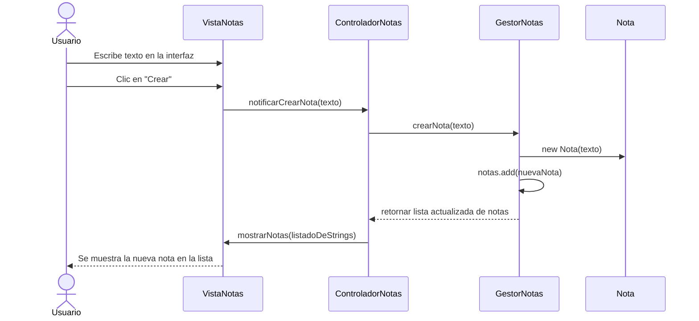

-----

#### HU2 – Eliminar notas (individual o todas)

Este diagrama ilustra la eliminación de una nota individual, delegando la responsabilidad de la colección de notas al `GestorNotas`.

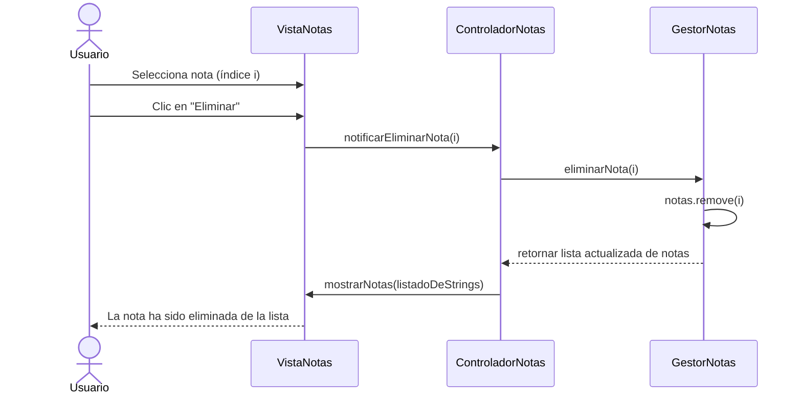

Para la opción de "Eliminar todas", el flujo es similar, pero el `ControladorNotas` llamaría al método `eliminarTodas()` del `GestorNotas`.

-----

#### HU3 – Guardar notas en `.txt`

Este es el diagrama más detallado, ya que refleja el flujo completo de datos para guardar una nota específica, incluyendo la interacción con la `Vista` para obtener la ruta del archivo y la delegación a la capa de persistencia (`NotaDAO`).

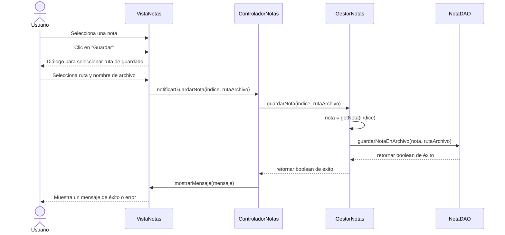

-----

#### HU4 – Interfaz Gráfica (GUI)

La existencia de la GUI (HU4) se evidencia en cada diagrama de secuencia. La `VistaNotas` está presente en todas las interacciones, mostrando la información y capturando las acciones del usuario.

-----

#### HU5 – Buscar palabra en las notas

Este diagrama muestra cómo el `Controlador` delega la lógica de búsqueda al `GestorNotas` y luego actualiza la `Vista` con los resultados.

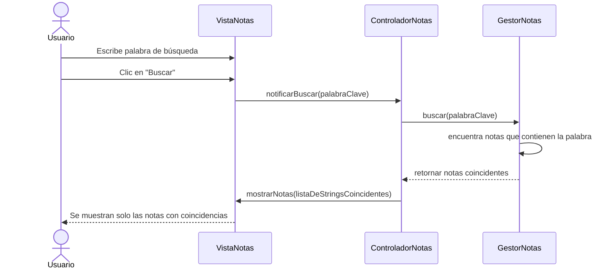

### Diseño de Interfaz de Usuario

#### Mockup básico usando PlantUML (tipo menú de aplicación):


<details>

```
@startsalt
skinparam BackgroundColor #2d333b
skinparam BorderThickness 1
skinparam BorderColor #4a5568
skinparam FontColor #e2e8f0

' Colores específicos para elementos dentro del Salt
skinparam salt {
    BackgroundColor #2d333b
    BorderColor #4a5568
    FontColor #e2e8f0
    LineColor #4a5568
}

{+
  {
    <size:18><b> <&pulse> <color:#90cdf4>FlashNotes - Notas Temporales</color></b></size> | . | <size:12><color:#a0aec0>2 notas activas</color></size> | <size:12><color:#fc8181><&x></color></size>
  }
  ====
  {
    [<size:12> <&plus> <color:#63b3ed>Nueva Nota</color></size>] | [<size:12> <&folder> <color:#68d391>Guardar TXT</color></size>] | [<size:12><&delete>️ <color:#fc8181>Limpiar Todo</color></size>] | . | "<color:#a0aec0><&magnifying-glass> Buscar en notas... (Ctrl+F)</color>"
  }
  ====
  {
    {SI
      <size:14><b><color:#90cdf4>Notas Activas</color></b></size>
      ----
      {[X] <size:14><b> <&file> <color:#90cdf4>Nota 1</color></b></size> [<size:10><color:#68d391>Activa</color></size>] | <size:10><color:#fc8181><&x></color></size>}
      <size:12><color:#a0aec0>Bienvenido a FlashNotes! Esta es tu aplicación...</color></size>
      <size:10><color:#a0aec0>30/07/2025 10:30:15</color></size>
      ----
      {[  ] <size:14><b> <&file> <color:#90cdf4>Nota 2</color></b></size> | <size:10><color:#fc8181><&x></color></size>}
      <size:12><color:#a0aec0>Lista de tareas para hoy: - Revisar emails...</color></size>
      <size:10><color:#a0aec0>30/07/2025 09:45:22</color></size>
      ----
      {[  ] <size:14><b> <&file> <color:#90cdf4>Nota 3</color></b></size> | <size:10><color:#fc8181><&x></color></size>}
      <size:12><color:#a0aec0>Ideas para el proyecto: Implementar búsqueda...</color></size>
      <size:10><color:#a0aec0>29/07/2025 16:20:10</color></size>
    } | {
      {
        <size:16><b><color:#90cdf4>Nota 1</color></b></size> | . | <size:12><color:#a0aec0>30/07/2025 10:30:15</color></size>
      }
      ====
      {+
        <size:14><b><color:#90cdf4>Bienvenido a FlashNotes!</color></b></size>
        .
        <size:14><color:#e2e8f0>Esta es tu aplicación de notas temporales.</color></size>
        <size:14><color:#e2e8f0>Las características principales son:</color></size>
        .
        <size:14><color:#e2e8f0>• Las notas son temporales por defecto</color></size>
        <size:14><color:#e2e8f0>• Se eliminan automáticamente al cerrar</color></size>
        <size:14><color:#e2e8f0>• Puedes guardar notas importantes como .txt</color></size>
        <size:14><color:#e2e8f0>• Búsqueda rápida en todas las notas</color></size>
        <size:14><color:#e2e8f0>• Interfaz minimalista y rápida</color></size>
        .
        <size:14><color:#e2e8f0>¡Comienza a escribir tus ideas rápidas!</color></size>
        .
        <size:14><color:#e2e8f0>Recuerda: Esta nota se eliminará automáticamente</color></size>
        <size:14><color:#e2e8f0>al cerrar FlashNotes, a menos que la guardes</color></size>
        <size:14><color:#e2e8f0>como archivo .txt</color></size>
      }
    }
  }
  ====
  {/ <size:12><color:#a0aec0>Línea: 12, Caracteres: 445</color></size> | . | <size:12><color:#ecc94b><b>⚠️ Notas temporales - Se eliminarán al cerrar</b></color></size> }
}
@endsalt
```
</details>

[Link del Diseño de la GUI](https://editor.plantuml.com/uml/jLV1Rjj64BqRy3zC4y1juLYcACcL29L8RTI50SCeOXy213cibYDvONANtIM5sAg0_47kFTMz-zHBqMFr9_c1_a9dHLAcATA8d9ImlBIM-sRcpPiP-gL9c4uC2vFjBNCbPCmqY-2GyQk9LgaCZbIeD3ntWqwdCthmYD81wejBmQya6WFjzStyR9VrUWVzylQnaac-YIxsnyxsrlRMrx3y2WsWYP4lxiQ2AmFs16284Sg4_WneqOgM4CuhJjiWOBQz1NGr1h3ShFFERjJuPRy-5H8hJy-jnxDTkvzR71fnWrwxxmz7FWntuZGqI3VSdlEU3nmUZBl-SSZCvPbAACWze9KPkC0eLfg5Q8RxouVzuVw8FXREXr-XHPySs_KBEEOmv8xlWbnYC9w8AIi158VN3evvlzrl-yETTtxbQHl5tFxwdgvIN6zM63QgC3NtGHrqHXqC_BCKfsmPJGNoBNdmuFXOXKHy2Q0VT0Pj_wUKwO1fk7XzyIZ2S8VIZWdw__xr0IeHdOee5XP31Qe6nBBuhCBUS2TY4od6rq9EzYQK6GhjC3MSK51cpBPQBVZcAD7Xxl6t1Ugp9gPcvoVPpKeCNIk6YWIohFzGpTYed0TxxT5LtC_Ul7xx0DDoAS9rVLbmQDS9gM3HyIlaPvxKKBPse5axyqhSQq8z52YdA4MWWC5z4Nm5FrBxeNg790KMXu8pBXP_IgAzHfqb0qxLGCVPTxxRTnst1st7wpXUkzU0y91NW0s8TUihz4iITIei8G42TMLaUVUxLDSUzOjNE1N6YZDY8ZIVnP4pyBezptM_F4UT_v-Zas3534s1MAjhv8dou2IAip5178qMVvjVKWpOvZIvWtif7NWkIScfHPXJMBCLIyND2lUWeVRho_FnFl_fwbwHL_IcfNExQzxLTQQc8dsaIG6qwg1pt6o6-lKrRaMUJQzaDG6RKjMCVKhdgM7J04Izk3C9ePCqj91Sn1OHZ99U8-edEF_n_HzWZMIk4bh9NQ2LmXXR-MtikGK-HrAmY8Ha4bYQg6XnQoEm6aPW8N3KckadGVzCuYSF9_bepTmNrlE4IVl-mLMae9MyIvu4VrZK5-Z5RInefP6Pg82CX0LRJm8-8UVqcDq0iI8Y5YxxuNLXvNCo-S_jaOf8uZSCh1ov5YEXIPH4oxAXv2RAUj_So2laAHBZNZRPB0zWLbac4sjvtfYbbIvADVg2GY8qUZ-cf506ihpZvYbOge9fVYccZweZxpFpzNUX_URPjhYJICoqtHTmbDSi6W-wtMetQsg7oFcWExAjw-DllzkNmBDA0w4fULvcMvQhQ5ITDDPp-dc9Ch3_E_m7)

---

### Diseño de Componentes

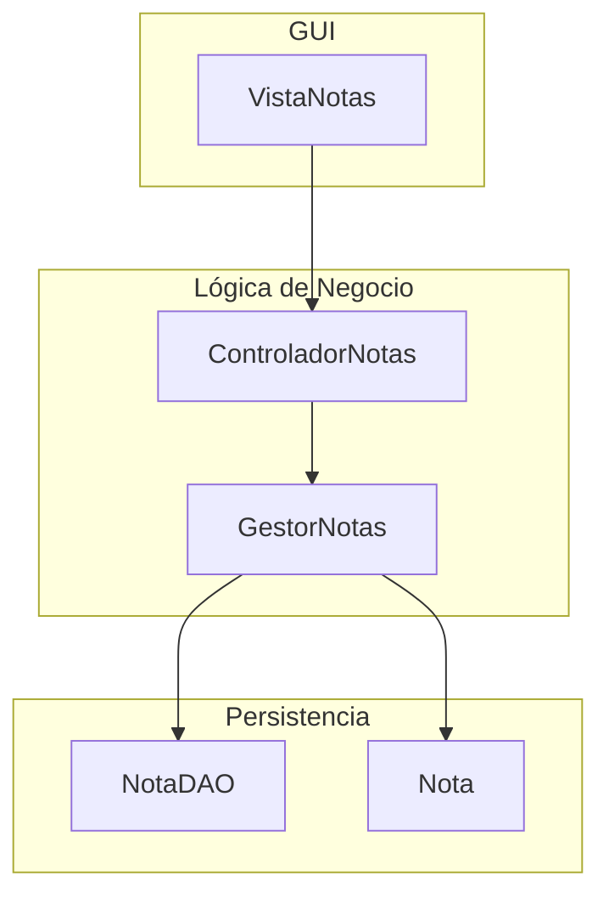


## Fase 3: Implementación
### Configuración del Entorno
- Entorno: Netbeans 19
- Lenguaje: Java JDK 23
- Git: git version 2.47.1.windows.2
- Gestor de paquetes: Maven
- BD: No aplica
Nota: **El código del proyecto esta alojado en una subcarpeta actual ./FlashNotes**

### Configuración de lógica y persistencia
Para esto creamos una serie de paquetes.
- modelo
- vista
- control

### 1\. Implementación de Lógica y Persistencia

#### Estructura de Paquetes

Organizar el código en los siguientes paquetes (o carpetas, en el caso de un IDE):

  - `com.mycompany.flashnotes.modelo` (o `logica`): Contendrá la clase `Nota` y `GestorNotas`.
  - `com.mycompany.flashnotes.persistencia`: Contendrá la clase `NotaDAO`.
  - `com.mycompany.flashnotes.vista`: Contendrá la clase `VistaNotas`.
  - `com.mycompany.flashnotes.control`: Contendrá la clase `ControladorNotas`.
  - `com.mycompany.flashnotes`: Contendrá la clase principal con el método `main`.

#### a) Implementación de las entidades (Modelo)

Aquí se creará la clase `Nota` con sus atributos y métodos.

**Clase `Nota`:**

```java
package com.mycompany.flashnotes.modelo;

import java.io.Serializable;

/**
 *
 * @author jesus
 */
public class Nota implements Serializable {
    private String contenido;

    public Nota(String contenido) {
        this.contenido = contenido;
    }

    public String getContenido() {
        return contenido;
    }

    public void setContenido(String contenido) {
        this.contenido = contenido;
    }
}
```

> **Nota:** La interfaz `Serializable` es importante para que el objeto `Nota` pueda ser guardado en archivos de forma eficiente.

#### b) Implementación de la capa de Persistencia (`NotaDAO`)

Aquí se implementará la clase `NotaDAO` que hemos diseñado.

**Clase `NotaDAO`:**

```java
package com.mycompany.flashnotes.persistencia;

import com.mycompany.flashnotes.modelo.Nota;
import java.io.BufferedReader;
import java.io.BufferedWriter;
import java.io.FileReader;
import java.io.FileWriter;
import java.io.IOException;

/**
 *
 * @author jesus
 */
public class NotaDAO {
    //Implementación de métodos para guardar/cargar archivos
    public boolean guardarNotaEnArchivo(Nota nota, String rutaArchivo) {
        try (BufferedWriter writer = new BufferedWriter(new FileWriter(rutaArchivo))) {
            writer.write(nota.getContenido());
            return true;
        } catch (IOException e) {
            e.printStackTrace();
            return false;
        }
    }

    public Nota cargarNotaDesdeArchivo(String rutaArchivo) {
        StringBuilder contenido = new StringBuilder();
        try (BufferedReader reader = new BufferedReader(new FileReader(rutaArchivo))) {
            String linea;
            while ((linea = reader.readLine()) != null) {
                contenido.append(linea).append(System.lineSeparator());
            }
            return new Nota(contenido.toString().trim());
        } catch (IOException e) {
            e.printStackTrace();
            return null;
        }
    }
    
    public void eliminarArchivoNotas(){
        // No aplica en notas temporales
    }
}

```


#### c) Implementación de la Lógica del Negocio (`GestorNotas`)

Esta clase conectará la lógica con la persistencia.

**Clase `GestorNotas`:**

```java
package com.mycompany.flashnotes.modelo;

import com.mycompany.flashnotes.persistencia.NotaDAO;
import java.util.ArrayList;
import java.util.List;

/**
 *
 * @author jesus
 */
public class GestorNotas {
    private List<Nota> notas;
    private NotaDAO notaDAO;
    
    public GestorNotas() {
        this.notas = new ArrayList<>();
        this.notaDAO = new NotaDAO();
        //En caso de crear una Nota inicial()
    }
    
    public void crearNota(String contenido){
        notas.add(new Nota(contenido));
    }
    
    public void eliminarNota(int indice){
        if(indice >= 0 && indice < notas.size()){
            notas.remove(indice);
        }
    }
    
    public boolean guardarNota(int indice, String rutaArchivo){
        if(indice >= 0 && indice < notas.size()){
            Nota notaAGuardar = notas.get(indice);
            return notaDAO.guardarNotaEnArchivo(notaAGuardar, rutaArchivo);
        }
        return false;
    }
    
    //... Implementación de buscar, eliminarTodas, etc.
    
    //Retornar las Notas
    public List<String> getContenidoNotas(){
        List<String> contenidos = new ArrayList<>();
        for(Nota nota: notas){
            contenidos.add(nota.getContenido());
        }
        return contenidos;
    }
}

```

-----

### 2\. Codificación de la GUI de Usuario

#### a) Codificación de las interfaces Swing

Aquí crearás la clase `VistaNotas` con todos los componentes y listeners.

**Clase `VistaNotas`:**

[VistaNotas.java](./FlashNotes/src/main/java/com/mycompany/flashnotes/vista/VistaNotas.java)

```java
package com.mycompany.flashnotes.vista;

import java.awt.Color;
import java.awt.event.ActionListener;
import java.awt.event.MouseAdapter;
import java.awt.event.MouseEvent;
import java.util.List;
import javax.swing.BorderFactory;
import javax.swing.JLabel;
import javax.swing.border.Border;

/**
 *
 * @author jesus
 */
public class VistaNotas extends javax.swing.JFrame {
    
    private int notaSeleccionadaIndex = -1;
    private final Border defaultBorder = BorderFactory.createEmptyBorder(5, 5, 5, 5);
    private final Border selectedBorder = BorderFactory.createLineBorder(new Color(155, 182, 255), 2);

    /**
     * Creates new form VistaNotas
     */
    public VistaNotas() {
        initComponents();
        // Inicializa el panel izquierdo para que use un BoxLayout vertical
        panelCuerpoIzquierdo.setLayout(new javax.swing.BoxLayout(panelCuerpoIzquierdo, javax.swing.BoxLayout.Y_AXIS));
    }
    
    // Método público para que el controlador pueda registrar sus listeners
    public void addCrearNotaListener(ActionListener listenForCrearBtn) {
        btnElementoNuevaNota.addActionListener(listenForCrearBtn);
        opcNuevaNota.addActionListener(listenForCrearBtn);
    }
    
    public void addGuardarNotaListener(ActionListener listenForGuardarBtn) {
        btnElementoGuardarTxt.addActionListener(listenForGuardarBtn);
        opcGuardarElemento.addActionListener(listenForGuardarBtn);
    }
    
    public void addLimpiarTodoListener(ActionListener listenForLimpiarBtn) {
        btnElementoLimpiarTodo.addActionListener(listenForLimpiarBtn);
        opcLimipiarTodo.addActionListener(listenForLimpiarBtn);
    }
    
    // Método para obtener el contenido de la nota del panel derecho
    public String getContenidoNota() {
        return txtCuerpoDerContenidoNota.getText();
    }
    
    // Método para establecer el contenido de la nota en el panel derecho
    public void setContenidoNota(String contenido) {
        txtCuerpoDerContenidoNota.setText(contenido);
    }
    
    // Método para obtener el índice de la nota actualmente seleccionada
    public int getNotaSeleccionadaIndex() {
        return notaSeleccionadaIndex;
    }
    
    // Método para actualizar la lista de notas en el panel izquierdo
    public void mostrarNotas(List<String> contenidos) {
        panelCuerpoIzquierdo.removeAll(); // Limpiar la lista anterior
        panelCuerpoIzquierdo.revalidate();
        panelCuerpoIzquierdo.repaint();

        for (int i = 0; i < contenidos.size(); i++) {
            String contenido = contenidos.get(i);
            
            // Crea un JLabel para cada nota
            JLabel notaLabel = new JLabel();
            notaLabel.setText(getTituloNota(contenido));
            notaLabel.setBorder(defaultBorder);
            notaLabel.putClientProperty("index", i); // Guarda el índice como propiedad
            
            // Añade un MouseListener para detectar clics
            notaLabel.addMouseListener(new MouseAdapter() {
                @Override
                public void mouseClicked(MouseEvent e) {
                    JLabel source = (JLabel) e.getSource();
                    int index = (int) source.getClientProperty("index");
                    seleccionarNota(index);
                }
            });

            panelCuerpoIzquierdo.add(notaLabel);
        }
        
        panelCuerpoIzquierdo.revalidate();
        panelCuerpoIzquierdo.repaint();
    }
    
    // Método para manejar la selección de una nota
    private void seleccionarNota(int index) {
        this.notaSeleccionadaIndex = index;
        
        // Deselecciona el label anterior
        for (int i = 0; i < panelCuerpoIzquierdo.getComponentCount(); i++) {
            JLabel label = (JLabel) panelCuerpoIzquierdo.getComponent(i);
            label.setBorder(defaultBorder);
        }

        // Selecciona el nuevo label y actualiza el contenido de la nota
        if (index >= 0 && index < panelCuerpoIzquierdo.getComponentCount()) {
            JLabel selectedLabel = (JLabel) panelCuerpoIzquierdo.getComponent(index);
            selectedLabel.setBorder(selectedBorder);
            // NOTA: El controlador se encargará de actualizar el contenido en el JTextArea.
        }
    }
    
    // Método auxiliar para generar el título de la nota
    private String getTituloNota(String contenido) {
        if (contenido == null || contenido.trim().isEmpty()) {
            return "Nueva Nota";
        }
        String[] palabras = contenido.trim().split("\\s+");
        StringBuilder titulo = new StringBuilder();
        for (int i = 0; i < Math.min(3, palabras.length); i++) {
            titulo.append(palabras[i]).append(" ");
        }
        return titulo.toString().trim();
    }

    /**
     * This method is called from within the constructor to initialize the form.
     * WARNING: Do NOT modify this code. The content of this method is always
     * regenerated by the Form Editor.
     */
    @SuppressWarnings("unchecked")
    // <editor-fold defaultstate="collapsed" desc="Generated Code">                          
    private void initComponents() {

        panelPrincipal = new javax.swing.JPanel();
        panelSuperior = new javax.swing.JPanel();
        lblEncabezadoImg = new javax.swing.JLabel();
        lblEncabezadoTxt = new javax.swing.JLabel();
        lblEncabezadoNot = new javax.swing.JLabel();
        panelElementos = new javax.swing.JPanel();
        btnElementoNuevaNota = new javax.swing.JButton();
        btnElementoGuardarTxt = new javax.swing.JButton();
        btnElementoLimpiarTodo = new javax.swing.JButton();
        lblElementoIconoBuscar = new javax.swing.JLabel();
        txtElementoBuscarNotaActual = new javax.swing.JTextField();
        panelCuerpo = new javax.swing.JPanel();
        scrollPanelCuerpoIzquierdo = new javax.swing.JScrollPane();
        panelCuerpoIzquierdo = new javax.swing.JPanel();
        lblCuerpoIzquierdoNotasActivas = new javax.swing.JLabel();
        panelCuerpoDerecho = new javax.swing.JPanel();
        scrollPanelCuerpoDer = new javax.swing.JScrollPane();
        txtCuerpoDerContenidoNota = new javax.swing.JTextArea();
        panelInferior = new javax.swing.JPanel();
        lblInferiorInformacion = new javax.swing.JLabel();
        lblInferiorAdvertencia = new javax.swing.JLabel();
        menuBarra = new javax.swing.JMenuBar();
        menuOpciones = new javax.swing.JMenu();
        opcNuevaNota = new javax.swing.JMenuItem();
        opcGuardarElemento = new javax.swing.JMenuItem();
        opcLimipiarTodo = new javax.swing.JMenuItem();
        menuApariencia = new javax.swing.JMenu();
        opcTemaOscuro = new javax.swing.JRadioButtonMenuItem();
        opcTemaClaro = new javax.swing.JRadioButtonMenuItem();
        menuAyuda = new javax.swing.JMenu();
        opcDocumentacion = new javax.swing.JMenuItem();
        opcSitioWeb = new javax.swing.JMenuItem();

        setDefaultCloseOperation(javax.swing.WindowConstants.EXIT_ON_CLOSE);
        setTitle("FlashNotes");
        setMinimumSize(new java.awt.Dimension(600, 350));

        panelPrincipal.setLayout(new javax.swing.BoxLayout(panelPrincipal, javax.swing.BoxLayout.Y_AXIS));

        panelSuperior.setMaximumSize(new java.awt.Dimension(32767, 50));
        panelSuperior.setPreferredSize(new java.awt.Dimension(400, 50));

        lblEncabezadoImg.setIcon(new javax.swing.ImageIcon(getClass().getResource("/imagenes/destello.png"))); // NOI18N
        panelSuperior.add(lblEncabezadoImg);

        lblEncabezadoTxt.setFont(new java.awt.Font("Segoe UI", 1, 18)); // NOI18N
        lblEncabezadoTxt.setText("FlashNotes - Notas Temporales");
        panelSuperior.add(lblEncabezadoTxt);

        lblEncabezadoNot.setText("2 notas act.");
        panelSuperior.add(lblEncabezadoNot);

        panelPrincipal.add(panelSuperior);

        panelElementos.setMaximumSize(new java.awt.Dimension(32767, 50));
        panelElementos.setPreferredSize(new java.awt.Dimension(400, 50));

        btnElementoNuevaNota.setIcon(new javax.swing.ImageIcon(getClass().getResource("/imagenes/nuevo.png"))); // NOI18N
        btnElementoNuevaNota.setText("Nueva Nota");
        panelElementos.add(btnElementoNuevaNota);

        btnElementoGuardarTxt.setIcon(new javax.swing.ImageIcon(getClass().getResource("/imagenes/guardar.png"))); // NOI18N
        btnElementoGuardarTxt.setText("Guardar TXT");
        panelElementos.add(btnElementoGuardarTxt);

        btnElementoLimpiarTodo.setIcon(new javax.swing.ImageIcon(getClass().getResource("/imagenes/borrar.png"))); // NOI18N
        btnElementoLimpiarTodo.setText("Limpiar Todo");
        panelElementos.add(btnElementoLimpiarTodo);

        lblElementoIconoBuscar.setIcon(new javax.swing.ImageIcon(getClass().getResource("/imagenes/buscar.png"))); // NOI18N
        panelElementos.add(lblElementoIconoBuscar);

        txtElementoBuscarNotaActual.setToolTipText("");
        txtElementoBuscarNotaActual.setMinimumSize(new java.awt.Dimension(90, 26));
        txtElementoBuscarNotaActual.setPreferredSize(new java.awt.Dimension(100, 26));
        panelElementos.add(txtElementoBuscarNotaActual);

        panelPrincipal.add(panelElementos);

        panelCuerpo.setLayout(new javax.swing.BoxLayout(panelCuerpo, javax.swing.BoxLayout.LINE_AXIS));

        scrollPanelCuerpoIzquierdo.setMaximumSize(new java.awt.Dimension(150, 32767));
        scrollPanelCuerpoIzquierdo.setMinimumSize(new java.awt.Dimension(150, 22));
        scrollPanelCuerpoIzquierdo.setPreferredSize(new java.awt.Dimension(150, 100));

        panelCuerpoIzquierdo.setLayout(new javax.swing.BoxLayout(panelCuerpoIzquierdo, javax.swing.BoxLayout.Y_AXIS));

        lblCuerpoIzquierdoNotasActivas.setFont(new java.awt.Font("Segoe UI", 1, 14)); // NOI18N
        lblCuerpoIzquierdoNotasActivas.setHorizontalAlignment(javax.swing.SwingConstants.CENTER);
        lblCuerpoIzquierdoNotasActivas.setText("Notas Activas");
        lblCuerpoIzquierdoNotasActivas.setMaximumSize(new java.awt.Dimension(170, 20));
        lblCuerpoIzquierdoNotasActivas.setMinimumSize(new java.awt.Dimension(120, 20));
        lblCuerpoIzquierdoNotasActivas.setPreferredSize(new java.awt.Dimension(120, 20));
        panelCuerpoIzquierdo.add(lblCuerpoIzquierdoNotasActivas);

        scrollPanelCuerpoIzquierdo.setViewportView(panelCuerpoIzquierdo);

        panelCuerpo.add(scrollPanelCuerpoIzquierdo);

        panelCuerpoDerecho.setBackground(new java.awt.Color(255, 153, 153));
        panelCuerpoDerecho.setLayout(new javax.swing.BoxLayout(panelCuerpoDerecho, javax.swing.BoxLayout.LINE_AXIS));

        txtCuerpoDerContenidoNota.setColumns(20);
        txtCuerpoDerContenidoNota.setRows(5);
        scrollPanelCuerpoDer.setViewportView(txtCuerpoDerContenidoNota);

        panelCuerpoDerecho.add(scrollPanelCuerpoDer);

        panelCuerpo.add(panelCuerpoDerecho);

        panelPrincipal.add(panelCuerpo);

        panelInferior.setMaximumSize(new java.awt.Dimension(32767, 25));
        panelInferior.setPreferredSize(new java.awt.Dimension(400, 25));
        panelInferior.setLayout(new javax.swing.BoxLayout(panelInferior, javax.swing.BoxLayout.LINE_AXIS));

        lblInferiorInformacion.setText("Linea: 12, Caracteres: 445");
        lblInferiorInformacion.setMaximumSize(new java.awt.Dimension(150, 16));
        lblInferiorInformacion.setMinimumSize(new java.awt.Dimension(150, 16));
        lblInferiorInformacion.setPreferredSize(new java.awt.Dimension(150, 16));
        panelInferior.add(lblInferiorInformacion);

        lblInferiorAdvertencia.setFont(new java.awt.Font("Segoe UI", 1, 12)); // NOI18N
        lblInferiorAdvertencia.setForeground(new java.awt.Color(255, 204, 51));
        lblInferiorAdvertencia.setIcon(new javax.swing.ImageIcon(getClass().getResource("/imagenes/advertencia.png"))); // NOI18N
        lblInferiorAdvertencia.setText("Notas temporales - Se eliminarán al cerrar");
        panelInferior.add(lblInferiorAdvertencia);

        panelPrincipal.add(panelInferior);

        menuOpciones.setText("Opciones");

        opcNuevaNota.setText("Nueva Nota");
        menuOpciones.add(opcNuevaNota);

        opcGuardarElemento.setText("Guardar");
        menuOpciones.add(opcGuardarElemento);

        opcLimipiarTodo.setText("LimpiarTodo");
        menuOpciones.add(opcLimipiarTodo);

        menuBarra.add(menuOpciones);

        menuApariencia.setText("Apariencia");

        opcTemaOscuro.setSelected(true);
        opcTemaOscuro.setText("Oscuro");
        menuApariencia.add(opcTemaOscuro);

        opcTemaClaro.setSelected(true);
        opcTemaClaro.setText("Claro");
        menuApariencia.add(opcTemaClaro);

        menuBarra.add(menuApariencia);

        menuAyuda.setText("Ayuda");

        opcDocumentacion.setText("Documentación");
        menuAyuda.add(opcDocumentacion);

        opcSitioWeb.setText("Donar");
        menuAyuda.add(opcSitioWeb);

        menuBarra.add(menuAyuda);

        setJMenuBar(menuBarra);

        javax.swing.GroupLayout layout = new javax.swing.GroupLayout(getContentPane());
        getContentPane().setLayout(layout);
        layout.setHorizontalGroup(
            layout.createParallelGroup(javax.swing.GroupLayout.Alignment.LEADING)
            .addComponent(panelPrincipal, javax.swing.GroupLayout.DEFAULT_SIZE, javax.swing.GroupLayout.DEFAULT_SIZE, Short.MAX_VALUE)
        );
        layout.setVerticalGroup(
            layout.createParallelGroup(javax.swing.GroupLayout.Alignment.LEADING)
            .addComponent(panelPrincipal, javax.swing.GroupLayout.DEFAULT_SIZE, 240, Short.MAX_VALUE)
        );

        pack();
    }// </editor-fold>                        

    /**
     * @param args the command line arguments
     */
    public static void main(String args[]) {
        /* Set the Nimbus look and feel */
        //<editor-fold defaultstate="collapsed" desc=" Look and feel setting code (optional) ">
        /* If Nimbus (introduced in Java SE 6) is not available, stay with the default look and feel.
         * For details see http://download.oracle.com/javase/tutorial/uiswing/lookandfeel/plaf.html 
         */
        try {
            for (javax.swing.UIManager.LookAndFeelInfo info : javax.swing.UIManager.getInstalledLookAndFeels()) {
                if ("Nimbus".equals(info.getName())) {
                    javax.swing.UIManager.setLookAndFeel(info.getClassName());
                    break;
                }
            }
        } catch (ClassNotFoundException ex) {
            java.util.logging.Logger.getLogger(VistaNotas.class.getName()).log(java.util.logging.Level.SEVERE, null, ex);
        } catch (InstantiationException ex) {
            java.util.logging.Logger.getLogger(VistaNotas.class.getName()).log(java.util.logging.Level.SEVERE, null, ex);
        } catch (IllegalAccessException ex) {
            java.util.logging.Logger.getLogger(VistaNotas.class.getName()).log(java.util.logging.Level.SEVERE, null, ex);
        } catch (javax.swing.UnsupportedLookAndFeelException ex) {
            java.util.logging.Logger.getLogger(VistaNotas.class.getName()).log(java.util.logging.Level.SEVERE, null, ex);
        }
        //</editor-fold>

        /* Create and display the form */
        java.awt.EventQueue.invokeLater(new Runnable() {
            public void run() {
                new VistaNotas().setVisible(true);
            }
        });
    }

    // Variables declaration - do not modify                     
    private javax.swing.JButton btnElementoGuardarTxt;
    private javax.swing.JButton btnElementoLimpiarTodo;
    private javax.swing.JButton btnElementoNuevaNota;
    private javax.swing.JLabel lblCuerpoIzquierdoNotasActivas;
    private javax.swing.JLabel lblElementoIconoBuscar;
    private javax.swing.JLabel lblEncabezadoImg;
    private javax.swing.JLabel lblEncabezadoNot;
    private javax.swing.JLabel lblEncabezadoTxt;
    private javax.swing.JLabel lblInferiorAdvertencia;
    private javax.swing.JLabel lblInferiorInformacion;
    private javax.swing.JMenu menuApariencia;
    private javax.swing.JMenu menuAyuda;
    private javax.swing.JMenuBar menuBarra;
    private javax.swing.JMenu menuOpciones;
    private javax.swing.JMenuItem opcDocumentacion;
    private javax.swing.JMenuItem opcGuardarElemento;
    private javax.swing.JMenuItem opcLimipiarTodo;
    private javax.swing.JMenuItem opcNuevaNota;
    private javax.swing.JMenuItem opcSitioWeb;
    private javax.swing.JRadioButtonMenuItem opcTemaClaro;
    private javax.swing.JRadioButtonMenuItem opcTemaOscuro;
    private javax.swing.JPanel panelCuerpo;
    private javax.swing.JPanel panelCuerpoDerecho;
    private javax.swing.JPanel panelCuerpoIzquierdo;
    private javax.swing.JPanel panelElementos;
    private javax.swing.JPanel panelInferior;
    private javax.swing.JPanel panelPrincipal;
    private javax.swing.JPanel panelSuperior;
    private javax.swing.JScrollPane scrollPanelCuerpoDer;
    private javax.swing.JScrollPane scrollPanelCuerpoIzquierdo;
    private javax.swing.JTextArea txtCuerpoDerContenidoNota;
    private javax.swing.JTextField txtElementoBuscarNotaActual;
    // End of variables declaration                   
}

```

#### b) Conexión de la UI con la lógica del negocio

Aquí se implementa la clase `ControladorNotas` para unir la `Vista` y el `Modelo`.

**Clase `ControladorNotas`:**

```java
// Archivo: com/flashnotes/controlador/ControladorNotas.java
package com.flashnotes.controlador;

import com.flashnotes.modelo.GestorNotas;
import com.flashnotes.vista.VistaNotas;
import java.awt.event.ActionEvent;
import java.awt.event.ActionListener;

public class ControladorNotas implements ActionListener {
    private GestorNotas gestor;
    private VistaNotas vista;
    
    public ControladorNotas(GestorNotas gestor, VistaNotas vista) {
        this.gestor = gestor;
        this.vista = vista;
        // Asignar este controlador como listener para los botones
        this.vista.addCrearListener(this);
        // ... Asignar otros listeners
    }

    @Override
    public void actionPerformed(ActionEvent e) {
        String comando = e.getActionCommand();
        if ("crear".equals(comando)) {
            gestor.crearNota("Nueva nota");
            vista.mostrarNotas(gestor.getContenidosNotas());
        } else if ("guardar".equals(comando)) {
            // Lógica para guardar una nota
        }
    }
}
```

-----

### 3\. Pruebas Unitarias y de Integración

Una vez que las clases estén implementadas, es fundamental probarlas. Te recomiendo usar un framework de pruebas como **JUnit**.

#### a) Pruebas Unitarias

  - **Para `GestorNotas`:** Verifica que los métodos `crearNota()`, `eliminarNota()`, y `buscar()` funcionen correctamente de forma aislada.
  - **Para `NotaDAO`:** Prueba que `guardarNotaEnArchivo()` guarde un objeto en un archivo y que `cargarNotaDesdeArchivo()` lo lea correctamente.

#### b) Pruebas de Integración

  - **Flujo completo:** Puedes simular un clic en un botón del controlador y verificar que la lógica del negocio se ejecute y que la vista se actualice correctamente.

## Pruebas
## Despliegue
## Mantenimiento