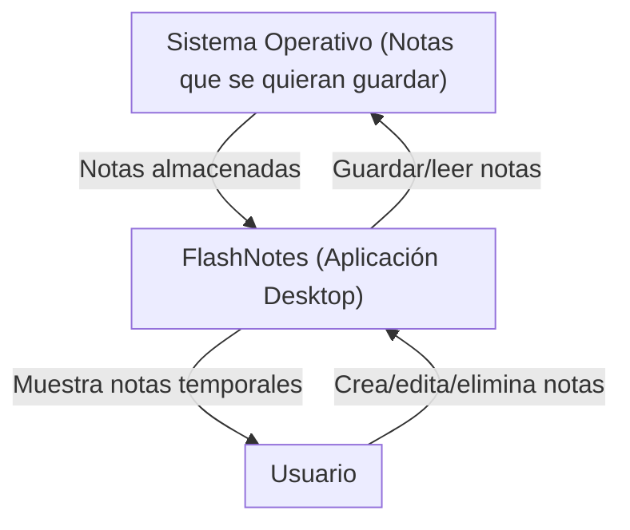
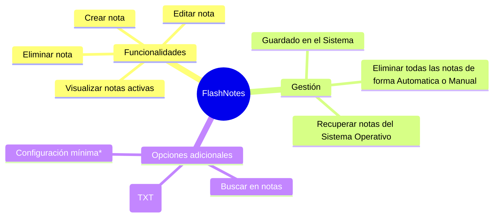
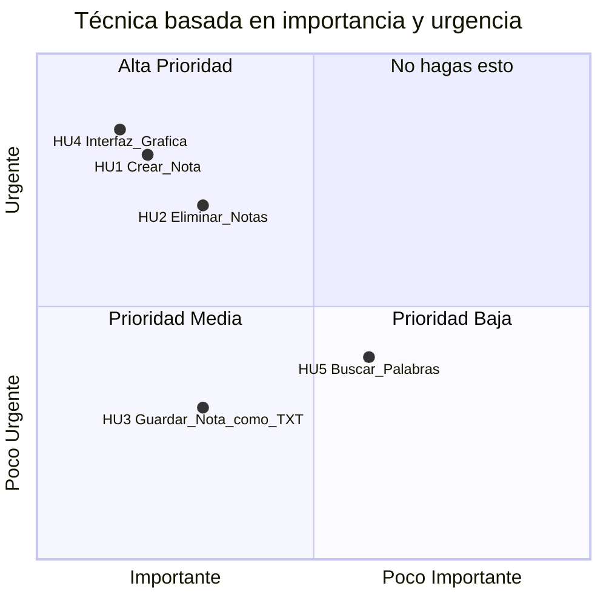

# FlashNotes - Documentación
## Requisitos
### Requerimientos del Negocio
#### Contexto del Proyecto
- Nombre de la Organización o Programador: Jesús Ángel Martínez Mendoza
- Tipo de Organización: Independiente
- Sector: No aplica
- Producto o servicios que ofrece: Programación de aplicaciones y Sistemas
- Necesidades especificas: No aplica
- Ubicación: No aplica

#### Identificación del Problema u Oportunidad de Mejora
El problema que se identifico, es que al usar el *Blog de notas* o *Notepad* tanto en linux como en Windows se generan muchas notas inncesarias y/o basura, esto en el uso diario de estas aplicaciones; hasta el momento aplicaciones similares de Notas general el mismo problema.

#### Objetivos del Negocio
**No aplica**

#### Declaración de la Visión del Producto

**FlashNotes** es un software dirijido al publico en general, que use notas rápidas para organizar sus ideas o notas, las cuáles son temporales, resuelve el problema de generación de basura y archivos innecesarios, así como dar la oportunidad de guardar la nota (en caso de requerirla), su principal ventaja, es que evita notas innecesarias, y solo temporales.

### Alcance
#### Diagrama de Contexto

#### Descripción del Alcance del Producto (Árbol de caracteristicas)

### Anexos
Entrevistas realizadas, documentos o reportes, diagramas, etc...

### Requerimientos del Usuario

**Identificación**:

- Como un **Usuario**, yo necesito **crear notas** así que de esta manera **tener texto a mi alcance**.
- Como un **Usuario**, yo necesito **que las notas se eliminen de forma manual o automatica** así que de esta manera **no genere notas innecesarias, o que fueron temporales**.
- Como un **Usuario**, yo necesito **guardar aquellas notas que considere que se deban guardar** así que de esta manera **se guarde como un `.txt` en mi computadora**.
- Como un **Usuario**, yo necesito **una Interfaz Gráfica de Usuario (GUI)** así que de esta manera **pueda tener acceso a las funcionalidades de la aplicación**.
- Como un **Usuario**, yo necesito **buscar una palabra o cadena de caracteres** así que de esta manera **pueda editar con mayor facilidad**.

**Formato**:

|Id | Nombre | Usuario | Descripción | Pruebas de Aceptación | Puntos / DI / Prioridad |
|---|--------|---------|-------------|-----------------------|-------------|
|HU1 | Creación de notas | Usuario | Crear un espacio para la nota | Verificar que el usuario tiene donde escribir y pueda realizar las notas | 1 |
|HU2 | Eliminar notas | Usuario / Aplicación | Eliminar todas las notas actuales al cerrar la aplicación o al hacer click en un botón | Verificar que al abrir la aplicación ya no halla notas, y después de hacer click | 1 |
|HU3 | Guardar notas | Usuario | Que la nota que el usuario quiera guardar se almacene en el SO con la extensión `.txt` | Verificar que el contenido del `.txt` sea el mismo que el de la aplicación al momento de guardar | 2 |
|HU4 | GUI | Usuario | Interfaz Gráfica de Usuario | Verificar que todos los botones y funcionalidades, esten funcionando como se deben | 1 |
|HU5 | Buscar Palabras | Usuario | Buscar palabra en la nota, y que mueva el puntero al inicio de la primera palabra encontrada | Ingresar texto, y verificar si esa palabra se encuentra | 3 | 

**Diagrama de Casos de Uso**

### Plan y Viabilidad

#### Agrupar las historias por Prioridad

### Estimar Tiempos

#####  **Fórmula General**

$$
\text{Tiempo Total} = \left( \frac{\text{Puntos Totales}}{\text{Número de Personas}} \right) \times \text{Factor de Ajuste}
$$

* **Número de personas = 1**
* **Factor de ajuste recomendado = 1.33** (para considerar imprevistos, errores, pausas, pruebas, etc.)

Supón que estas son tus HU y sus puntos de prioridad (ahora cuanto más alto, más dificil de programar).

| ID | Historia de Usuario               | Puntos | Prioridad |
| -- | --------------------------------- | ------ | --------- |
| 1  | Crear Nota                        | 3      | Alta      |
| 2  | Eliminar Todas las Notas          | 3      | Alta      |
| 3  | Guardar Nota como TXT             | 2      | Media     |
| 4  | Interfaz Gráfica de Usuario (GUI) | 5      | Alta      |
| 5  | Buscar Palabras en la Nota        | 1      | Baja      |

**Total de puntos = 14**

Entonces:

$$
\text{Tiempo Total} = \left( \frac{14}{1} \right) \times 1.33 = 18.62 \text{ días} \approx 19 \text{ días}
$$

---
#####  **Planificación en Etapas (Estilo Cascada)**

Aunque la metodología cascada no tiene iteraciones como tal, puedes desglosarlo por fases:

| Fase                | Actividades Relacionadas                                                      | Duración Estimada |
|---------------------|-------------------------------------------------------------------------------|-------------------|
| **1. Análisis**      | - Revisar y confirmar requerimientos del usuario                             | 1 día             |
|                     | - Redactar historias de usuario y validar con ejemplos prácticos              | 1 día             |
| **2. Diseño**        | - Crear boceto de la interfaz (mockup)                                        | 1 día             |
|                     | - Definir estructura de carpetas, clases, y funciones base                    | 2 días            |
|                     | - Elegir librerías o tecnologías (por ejemplo, `tkinter`, `PyQt`, etc.)       | 1 día             |
| **3. Implementación**| - Programar funcionalidades por orden de prioridad (HU1 → HU5)               | 10 días           |
|                     | - Integrar cada funcionalidad con GUI                                         | 2 días            |
| **4. Pruebas**       | - Pruebas funcionales (crear, guardar, borrar notas)                         | 2 días            |
|                     | - Pruebas de interfaz y usabilidad                                            | 1 día             |
| **5. Documentación** | - Documentación técnica y de usuario (`README.md`, comentarios en código)     | 2 días            |
| **6. Entrega/Ajustes**| - Corrección de errores, mejoras visuales y funcionales, empaquetado final  | 2 días            |

| ** Total estimado**                                                                          | **25 días**        |

#### Estudio de Viabilidad

**Viabilidad Técnica**

| Aspecto Técnico | Disponibilidad Actual | Brechas o Necesidades | Observaciones |
|-----------------|-----------------------|-----------------------|---------------|
|Infrestructura | - | - | - | - |
|Equipo | Computadora Personal | - | - | - |
|Software | - | - | - | - |
|Capacidad del Personal | - | - | - | - |

**Viabilidad Económica**

| Recurso | Alternativa 1 (Local) | Alternativa 2 (Nube) | Costo Anual (Local) | Costo Anual (Nube) | Observaciones |
|Hardware|-|-|-|-|-|
|Software|-|-|-|-|-|
|Almacenamiento|Disco Local|-|-|-|-|
|Conectividad|-|-|-|-|-|

**Diagrama de Tendencias Costo - Beneficio**
No aplica

**Viabilidad Operativa**

| **Factor**                     | **Descripción**                                                                  | **Estado Actual**                     | **Necesidades o Brechas**                 | **Observaciones**                                          |
| ------------------------------ | -------------------------------------------------------------------------------- | ------------------------------------- | ----------------------------------------- | ---------------------------------------------------------- |
| **Disponibilidad de Personal** | Capacidad del personal para operar y mantener el sistema.                        | Un programador (tú mismo).            | Buena gestión del tiempo.                 | Es posible avanzar en tiempos razonables con organización. |
| **Procesos Actuales**          | Compatibilidad de los procesos actuales con el sistema propuesto.                | No existen procesos formales.         | Definir flujo de trabajo personal.        | Puedes aplicar Git y una metodología simple como Kanban.   |
| **Infraestructura**            | Adecuación de la infraestructura actual para soportar el sistema.                | PC personal con Linux/Windows.        | Ninguna.                                  | El proyecto no demanda muchos recursos.                    |
| **Cultura Organizacional**     | Aceptación y adaptación de los usuarios al nuevo sistema.                        | No aplica.                            | -                                         | Al ser personal, puedes validar usabilidad contigo mismo.  |
| **Soporte Técnico**            | Disponibilidad de soporte técnico para resolver problemas y mantener el sistema. | Autosoporte con búsqueda y comunidad. | Participar en foros y leer documentación. | Stack Overflow, GitHub y ChatGPT pueden ser aliados clave. |

## Diseño
## Implementación
## Pruebas
## Despliegue
## Mantenimiento