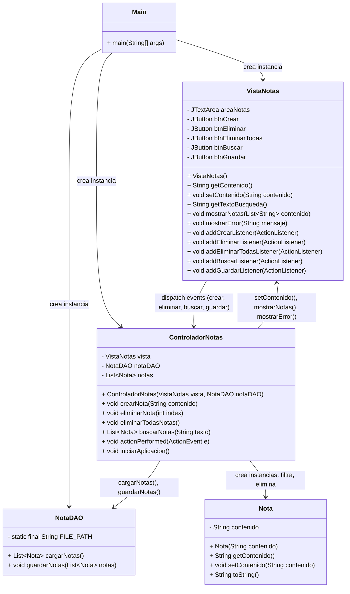
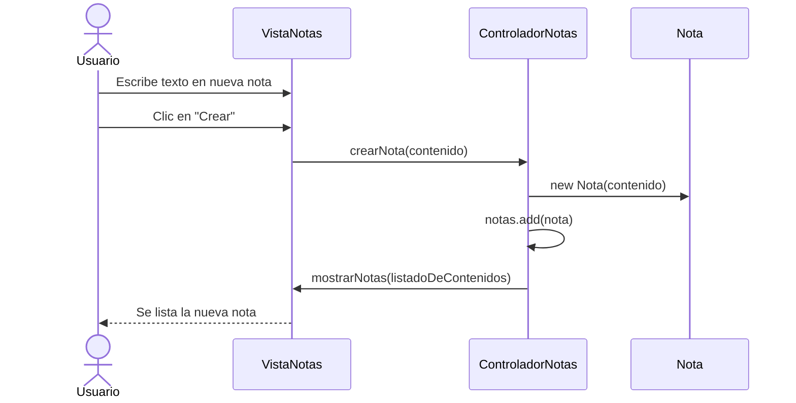
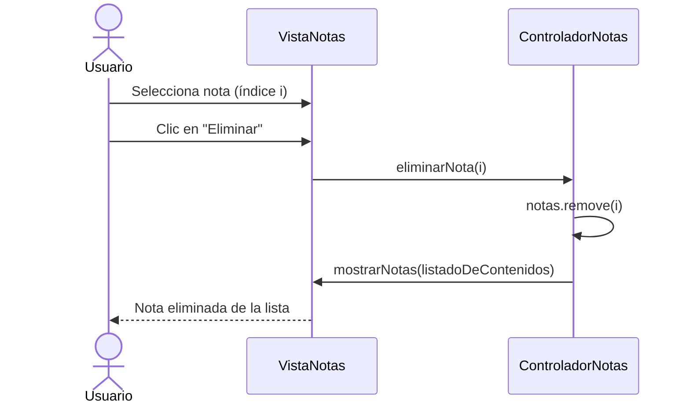
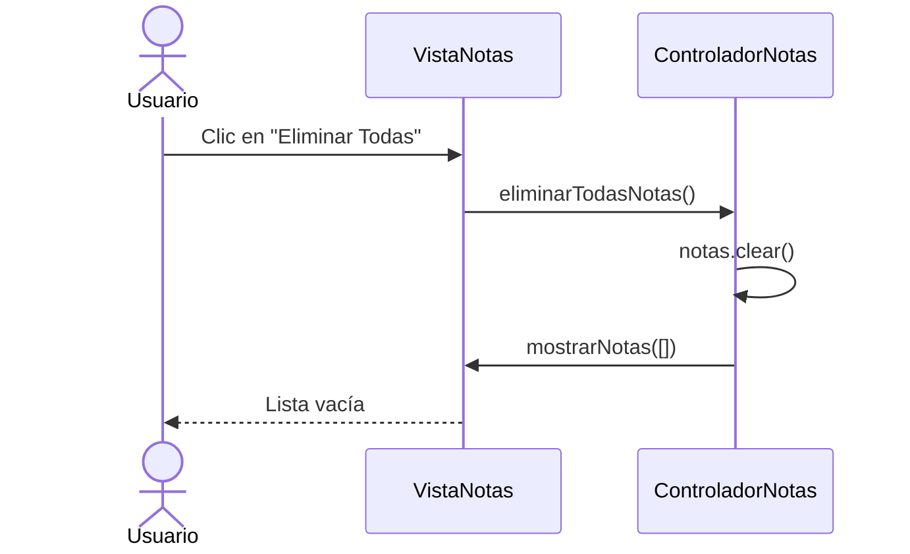
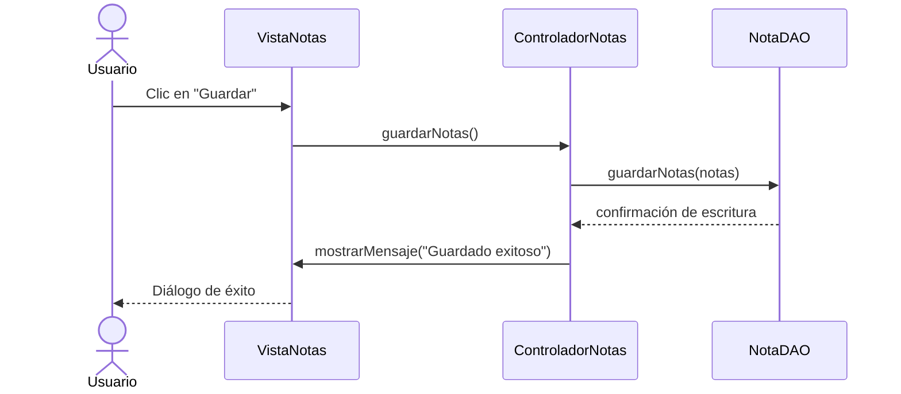
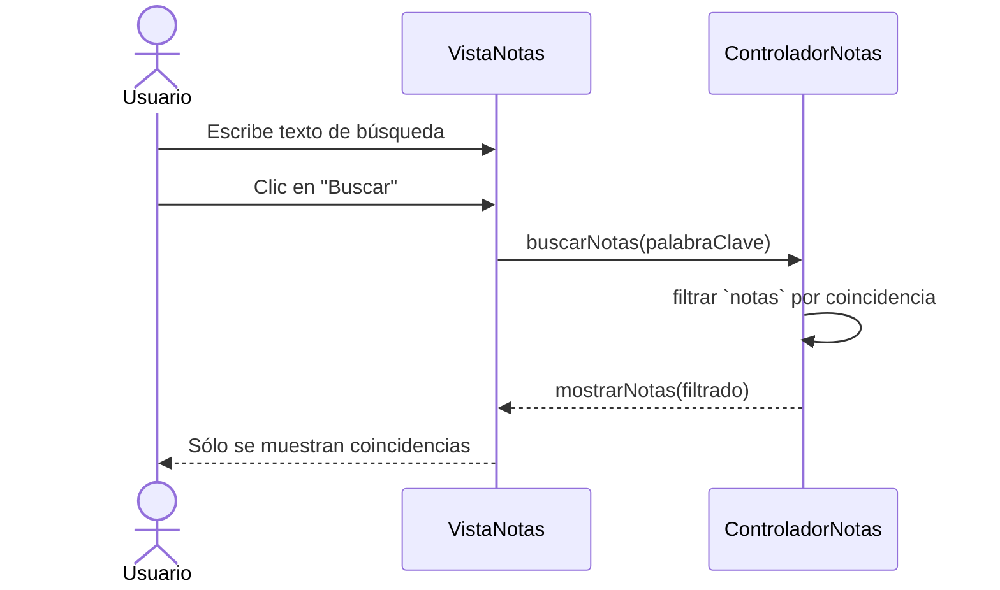

# FlashNotes - Documentación
## Fase 1: Requisitos
### Requerimientos del Negocio
#### Contexto del Proyecto
- Nombre de la Organización o Programador: Jesús Ángel Martínez Mendoza
- Tipo de Organización: Independiente
- Sector: No aplica
- Producto o servicios que ofrece: Programación de aplicaciones y Sistemas
- Necesidades especificas: No aplica
- Ubicación: No aplica

#### Identificación del Problema u Oportunidad de Mejora
El problema que se identifico, es que al usar el *Blog de notas* o *Notepad* tanto en linux como en Windows se generan muchas notas innecesarias y/o basura, esto en el uso diario de estas aplicaciones; hasta el momento aplicaciones similares de notas general el mismo problema.

#### Objetivos del Negocio
Ofrecer una herramienta sencilla para notas temporales que reduzca el desorden digital en la productividad diaria de los usuarios.

#### Declaración de la Visión del Producto

**FlashNotes** es un software dirigido al publico en general, que use notas rápidas para organizar sus ideas o notas, las cuales son temporales, resuelve el problema de generación de basura y archivos innecesarios, así como dar la oportunidad de guardar la nota (en caso de requerirla), su principal ventaja, es que evita notas innecesarias, y solo temporales.


### Alcance
#### Diagrama de Contexto


#### Descripción del Alcance del Producto (Árbol de caracteristicas)


### Anexos
Entrevistas realizadas, documentos o reportes, diagramas, etc...

### Requerimientos del Usuario

**Identificación**:

- Como un **Usuario**, yo necesito **crear notas** así que de esta manera **tener texto a mi alcance**.
- Como un **Usuario**, yo necesito **que las notas se eliminen de forma manual o automatica** así que de esta manera **no genere notas innecesarias, o que fueron temporales**.
- Como un **Usuario**, yo necesito **guardar aquellas notas que considere que se deban guardar** así que de esta manera **se guarde como un `.txt` en mi computadora**.
- Como un **Usuario**, yo necesito **una Interfaz Gráfica de Usuario (GUI)** así que de esta manera **pueda tener acceso a las funcionalidades de la aplicación**.
- Como un **Usuario**, yo necesito **buscar una palabra o cadena de caracteres** así que de esta manera **pueda editar con mayor facilidad**.

**Formato**:

|Id | Nombre | Usuario | Descripción | Pruebas de Aceptación | Puntos / DI / Prioridad |
|---|--------|---------|-------------|-----------------------|-------------|
|HU1 | Creación de notas | Usuario | Crear un espacio para la nota | Verificar que el usuario tiene donde escribir y pueda realizar las notas | 1 |
|HU2 | Eliminar notas | Usuario / Aplicación | Eliminar todas las notas actuales al cerrar la aplicación o al hacer click en un botón | Verificar que al abrir la aplicación ya no haya notas, y después de hacer click | 1 |
|HU3 | Guardar notas | Usuario | Que la nota que el usuario quiera guardar se almacene en el SO con la extensión `.txt` | Verificar que el contenido del `.txt` sea el mismo que el de la aplicación al momento de guardar | 2 |
|HU4 | GUI | Usuario | Interfaz Gráfica de Usuario | Verificar que todos los botones y funcionalidades, esten funcionando como se deben | 1 |
|HU5 | Buscar Palabras | Usuario | Buscar palabra en la nota, y que mueva el puntero al inicio de la primera palabra encontrada | Ingresar texto, y verificar si esa palabra se encuentra | 3 | 

**Diagrama de Casos de Uso**


### Plan y Viabilidad

#### Agrupar las historias por Prioridad


### Estimar Tiempos

#####  **Fórmula General**

$$
\text{Tiempo Total} = \left( \frac{\text{Puntos Totales}}{\text{Número de Personas}} \right) \times \text{Factor de Ajuste}
$$


* **Número de personas = 1**
* **Factor de ajuste recomendado = 1.33** (para considerar imprevistos, errores, pausas, pruebas, etc.)

Supón que estas son tus HU y sus puntos de prioridad (ahora cuanto más alto, más dificil de programar).

| ID | Historia de Usuario               | Puntos | Prioridad |
| -- | --------------------------------- | ------ | --------- |
| 1  | Crear Nota                        | 3      | Alta      |
| 2  | Eliminar Todas las Notas          | 3      | Alta      |
| 3  | Guardar Nota como TXT             | 2      | Media     |
| 4  | Interfaz Gráfica de Usuario (GUI) | 5      | Alta      |
| 5  | Buscar Palabras en la Nota        | 1      | Baja      |


**Total de puntos = 14**

Entonces:

$$
\text{Tiempo Total} = \left( \frac{14}{1} \right) \times 1.33 = 18.62 \text{ días} \approx 19 \text{ días}
$$


---
#####  **Planificación en Etapas (Estilo Cascada)**

Aunque la metodología cascada no tiene iteraciones como tal, puedes desglosarlo por fases:

| Fase                | Actividades Relacionadas                                                      | Duración Estimada |
|---------------------|-------------------------------------------------------------------------------|-------------------|
| **1. Análisis**      | - Revisar y confirmar requerimientos del usuario                             | 1 día             |
|                     | - Redactar historias de usuario y validar con ejemplos prácticos              | 1 día             |
| **2. Diseño**        | - Crear boceto de la interfaz (mockup)                                        | 1 día             |
|                     | - Definir estructura de carpetas, clases, y funciones base                    | 2 días            |
|                     | - Elegir librerías o tecnologías (por ejemplo, `tkinter`, `PyQt`, etc.)       | 1 día             |
| **3. Implementación**| - Programar funcionalidades por orden de prioridad (HU1 → HU5)               | 10 días           |
|                     | - Integrar cada funcionalidad con GUI                                         | 2 días            |
| **4. Pruebas**       | - Pruebas funcionales (crear, guardar, borrar notas)                         | 2 días            |
|                     | - Pruebas de interfaz y usabilidad                                            | 1 día             |
| **5. Documentación** | - Documentación técnica y de usuario (`README.md`, comentarios en código)     | 2 días            |
| **6. Entrega/Ajustes**| - Corrección de errores, mejoras visuales y funcionales, empaquetado final  | 2 días            |

| ** Total estimado**                                                                          | **25 días**        |


#### Estudio de Viabilidad

**Viabilidad Técnica**

| Aspecto Técnico | Disponibilidad Actual | Brechas o Necesidades | Observaciones |
|-----------------|-----------------------|-----------------------|---------------|
|Infrestructura | - | - | - | - |
|Equipo | Computadora Personal | - | - | - |
|Software | - | - | - | - |
|Capacidad del Personal | - | - | - | - |

**Viabilidad Económica**


| Recurso | Alternativa 1 (Local) | Alternativa 2 (Nube) | Costo Anual (Local) | Costo Anual (Nube) | Observaciones |
|-|-|-|-|-|-|
|Hardware|-|-|-|-|-|
|Software|-|-|-|-|-|
|Almacenamiento|Disco Local|-|-|-|-|
|Conectividad|-|-|-|-|-|


**Diagrama de Tendencias Costo - Beneficio**
No aplica

**Viabilidad Operativa**

| **Factor**                     | **Descripción**                                                                  | **Estado Actual**                     | **Necesidades o Brechas**                 | **Observaciones**                                          |
| ------------------------------ | -------------------------------------------------------------------------------- | ------------------------------------- | ----------------------------------------- | ---------------------------------------------------------- |
| **Disponibilidad de Personal** | Capacidad del personal para operar y mantener el sistema.                        | Un programador .            | Buena gestión del tiempo.                 | Es posible avanzar en tiempos razonables con organización. |
| **Procesos Actuales**          | Compatibilidad de los procesos actuales con el sistema propuesto.                | No existen procesos formales.         | Definir flujo de trabajo personal.        | Puedes aplicar Git y una metodología simple como Kanban.   |
| **Infraestructura**            | Adecuación de la infraestructura actual para soportar el sistema.                | PC personal con Linux/Windows.        | Ninguna.                                  | El proyecto no demanda muchos recursos.                    |
| **Cultura Organizacional**     | Aceptación y adaptación de los usuarios al nuevo sistema.                        | No aplica.                            | -                                         | Al ser personal, puedes validar usabilidad contigo mismo.  |
| **Soporte Técnico**            | Disponibilidad de soporte técnico para resolver problemas y mantener el sistema. | Autosoporte con búsqueda y comunidad. | Participar en foros y leer documentación. | Stack Overflow, GitHub y ChatGPT pueden ser aliados clave. |


---

## Fase 2: Diseño
>(Qué esto no lo haga ChatGPT porfavor, te lo digo por experiencia).

### Identificación de Entidades

* `Main`
* `VistaNotas`
* `ControladorNotas`
* `NotaDao`
* `Nota`

---

### Diseño Arquitectónico

#### Definición de la arquitectura

Se usará el patrón de diseño **Modelo-Vista-Controlador (MVC)** para separar responsabilidades y facilitar el mantenimiento.


#### Selección de Tecnología

* Lenguaje: `Java 23`
* GUI: `Java Swing`
* Persistencia: Archivos `.txt` (no se usa base de datos)
* Arquitectura: `MVC`

---

### Diseño Estático

#### Diagrama de Clases UML

Note como algunas clases no poseen constructor.



#### Modelo Lógico de Datos (ERD)

No aplica porque **no se usará base de datos**.

---

### Diseño Dinámico

A continuación se presentan los diagramas de secuencia actualizados para reflejar todas las historias de usuario (HU) y las operaciones del controlador tal como en el diagrama general:

---

#### HU1 – Crear una nota



---

#### HU2 – Eliminar una nota individual



---

#### HU3 – Eliminar todas las notas



---

#### HU4 – Guardar notas en `.txt`



---

#### HU5 – Buscar palabra en las notas



---

> **HU4 (Interfaz Gráfica)**
> La HU4 (existencia y funcionalidad de la GUI) está implícita en todos los diagramas: cada botón de la vista dispara un listener que invoca al controlador y actualiza la interfaz via `mostrarNotas()` o `mostrarMensaje()`.

---

### Diseño de Interfaz de Usuario

#### Mockup básico usando PlantUML (tipo menú de aplicación):


<details>

```
@startsalt
skinparam BackgroundColor #2d333b
skinparam BorderThickness 1
skinparam BorderColor #4a5568
skinparam FontColor #e2e8f0

' Colores específicos para elementos dentro del Salt
skinparam salt {
    BackgroundColor #2d333b
    BorderColor #4a5568
    FontColor #e2e8f0
    LineColor #4a5568
}

{+
  {
    <size:18><b> <&pulse> <color:#90cdf4>FlashNotes - Notas Temporales</color></b></size> | . | <size:12><color:#a0aec0>2 notas activas</color></size> | <size:12><color:#fc8181><&x></color></size>
  }
  ====
  {
    [<size:12> <&plus> <color:#63b3ed>Nueva Nota</color></size>] | [<size:12> <&folder> <color:#68d391>Guardar TXT</color></size>] | [<size:12><&delete>️ <color:#fc8181>Limpiar Todo</color></size>] | . | "<color:#a0aec0><&magnifying-glass> Buscar en notas... (Ctrl+F)</color>"
  }
  ====
  {
    {SI
      <size:14><b><color:#90cdf4>Notas Activas</color></b></size>
      ----
      {[X] <size:14><b> <&file> <color:#90cdf4>Nota 1</color></b></size> [<size:10><color:#68d391>Activa</color></size>] | <size:10><color:#fc8181><&x></color></size>}
      <size:12><color:#a0aec0>Bienvenido a FlashNotes! Esta es tu aplicación...</color></size>
      <size:10><color:#a0aec0>30/07/2025 10:30:15</color></size>
      ----
      {[  ] <size:14><b> <&file> <color:#90cdf4>Nota 2</color></b></size> | <size:10><color:#fc8181><&x></color></size>}
      <size:12><color:#a0aec0>Lista de tareas para hoy: - Revisar emails...</color></size>
      <size:10><color:#a0aec0>30/07/2025 09:45:22</color></size>
      ----
      {[  ] <size:14><b> <&file> <color:#90cdf4>Nota 3</color></b></size> | <size:10><color:#fc8181><&x></color></size>}
      <size:12><color:#a0aec0>Ideas para el proyecto: Implementar búsqueda...</color></size>
      <size:10><color:#a0aec0>29/07/2025 16:20:10</color></size>
    } | {
      {
        <size:16><b><color:#90cdf4>Nota 1</color></b></size> | . | <size:12><color:#a0aec0>30/07/2025 10:30:15</color></size>
      }
      ====
      {+
        <size:14><b><color:#90cdf4>Bienvenido a FlashNotes!</color></b></size>
        .
        <size:14><color:#e2e8f0>Esta es tu aplicación de notas temporales.</color></size>
        <size:14><color:#e2e8f0>Las características principales son:</color></size>
        .
        <size:14><color:#e2e8f0>• Las notas son temporales por defecto</color></size>
        <size:14><color:#e2e8f0>• Se eliminan automáticamente al cerrar</color></size>
        <size:14><color:#e2e8f0>• Puedes guardar notas importantes como .txt</color></size>
        <size:14><color:#e2e8f0>• Búsqueda rápida en todas las notas</color></size>
        <size:14><color:#e2e8f0>• Interfaz minimalista y rápida</color></size>
        .
        <size:14><color:#e2e8f0>¡Comienza a escribir tus ideas rápidas!</color></size>
        .
        <size:14><color:#e2e8f0>Recuerda: Esta nota se eliminará automáticamente</color></size>
        <size:14><color:#e2e8f0>al cerrar FlashNotes, a menos que la guardes</color></size>
        <size:14><color:#e2e8f0>como archivo .txt</color></size>
      }
    }
  }
  ====
  {/ <size:12><color:#a0aec0>Línea: 12, Caracteres: 445</color></size> | . | <size:12><color:#ecc94b><b>⚠️ Notas temporales - Se eliminarán al cerrar</b></color></size> }
}
@endsalt
```
</details>

[Link del Diseño de la GUI](https://editor.plantuml.com/uml/jLV1Rjj64BqRy3zC4y1juLYcACcL29L8RTI50SCeOXy213cibYDvONANtIM5sAg0_47kFTMz-zHBqMFr9_c1_a9dHLAcATA8d9ImlBIM-sRcpPiP-gL9c4uC2vFjBNCbPCmqY-2GyQk9LgaCZbIeD3ntWqwdCthmYD81wejBmQya6WFjzStyR9VrUWVzylQnaac-YIxsnyxsrlRMrx3y2WsWYP4lxiQ2AmFs16284Sg4_WneqOgM4CuhJjiWOBQz1NGr1h3ShFFERjJuPRy-5H8hJy-jnxDTkvzR71fnWrwxxmz7FWntuZGqI3VSdlEU3nmUZBl-SSZCvPbAACWze9KPkC0eLfg5Q8RxouVzuVw8FXREXr-XHPySs_KBEEOmv8xlWbnYC9w8AIi158VN3evvlzrl-yETTtxbQHl5tFxwdgvIN6zM63QgC3NtGHrqHXqC_BCKfsmPJGNoBNdmuFXOXKHy2Q0VT0Pj_wUKwO1fk7XzyIZ2S8VIZWdw__xr0IeHdOee5XP31Qe6nBBuhCBUS2TY4od6rq9EzYQK6GhjC3MSK51cpBPQBVZcAD7Xxl6t1Ugp9gPcvoVPpKeCNIk6YWIohFzGpTYed0TxxT5LtC_Ul7xx0DDoAS9rVLbmQDS9gM3HyIlaPvxKKBPse5axyqhSQq8z52YdA4MWWC5z4Nm5FrBxeNg790KMXu8pBXP_IgAzHfqb0qxLGCVPTxxRTnst1st7wpXUkzU0y91NW0s8TUihz4iITIei8G42TMLaUVUxLDSUzOjNE1N6YZDY8ZIVnP4pyBezptM_F4UT_v-Zas3534s1MAjhv8dou2IAip5178qMVvjVKWpOvZIvWtif7NWkIScfHPXJMBCLIyND2lUWeVRho_FnFl_fwbwHL_IcfNExQzxLTQQc8dsaIG6qwg1pt6o6-lKrRaMUJQzaDG6RKjMCVKhdgM7J04Izk3C9ePCqj91Sn1OHZ99U8-edEF_n_HzWZMIk4bh9NQ2LmXXR-MtikGK-HrAmY8Ha4bYQg6XnQoEm6aPW8N3KckadGVzCuYSF9_bepTmNrlE4IVl-mLMae9MyIvu4VrZK5-Z5RInefP6Pg82CX0LRJm8-8UVqcDq0iI8Y5YxxuNLXvNCo-S_jaOf8uZSCh1ov5YEXIPH4oxAXv2RAUj_So2laAHBZNZRPB0zWLbac4sjvtfYbbIvADVg2GY8qUZ-cf506ihpZvYbOge9fVYccZweZxpFpzNUX_URPjhYJICoqtHTmbDSi6W-wtMetQsg7oFcWExAjw-DllzkNmBDA0w4fULvcMvQhQ5ITDDPp-dc9Ch3_E_m7)

---

### Diseño de Componentes


## Fase 3: Implementación
### Configuración del Entorno
- Entorno: Netbeans 19
- Lenguaje: Java JDK 23
- Git: git version 2.47.1.windows.2
- Gestor de paquetes: Maven
- BD: No aplica
Nota: **El código del proyecto esta alojado en una subcarpeta actual ./FlashNotes**

### Configuración de lógica y persistencia
Para esto creamos una serie de paquetes.
- modelo
- vista
- control

#### Implementación de las entidades del (Modelo o Lógica)


### Pruebas Unitarias de Integración

## Pruebas
## Despliegue
## Mantenimiento